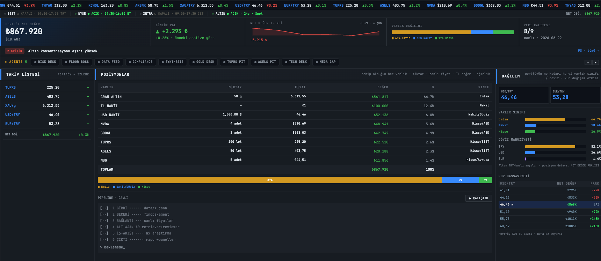
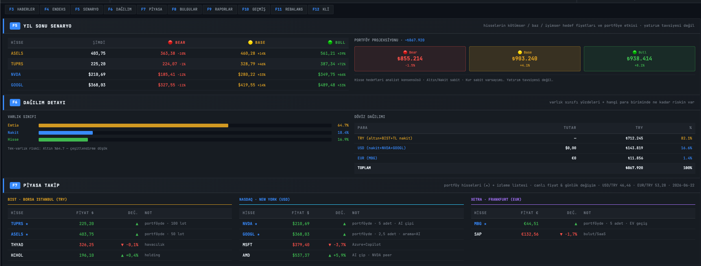

<div align="center">


# Claude FinOps Terminal

**A reference implementation of Claude's finance capabilities —
live portfolio terminal, AI risk analysis, macro stress tests, PDF report parsing,
tax harvesting, news sentiment, benchmarking and rebalance suggestions.**

[English](#-english) · [Türkçe](#-türkçe)


</div>

---





---

## 🇬🇧 English

### Why Claude for finance?

Most financial tools use Claude as a chatbot layer on top of a data pipeline.
This project flips that: **Claude is the pipeline.** Every analysis runs through
Claude's native capabilities — long context, vision, adaptive thinking, tool use,
parallel agents — not a fixed rule engine.

| Claude capability | How it's used here |
|---|---|
| **1M token context** | Read an entire 200-page annual report in one pass — not a summary, the whole thing |
| **Vision / PDF** | Parse 10-K filings, scanned bank statements, chart screenshots natively — no OCR pre-step |
| **Adaptive thinking** | Step-by-step DCF reasoning, macro sensitivity chains, tax optimization logic |
| **Parallel subagents** | News sentiment + index benchmarking run simultaneously in the Intel phase |
| **Tool use / MCP** | Yahoo Finance connector wired natively — no middleware, no API key |
| **Structured output** | Risk findings, portfolio data, stress test results returned as strict JSON schemas |
| **Agent composition** | Skill + connector + subagent — Anthropic's reference finance-agent pattern |
| **Multilingual** | Turkish and English financial analysis with full context, not translation |
| **Web search / fetch** | Live news, regulatory filings, earnings releases pulled at analysis time |

### Full capability overview

| Capability | Skill / feature | Status |
|---|---|---|
| Live portfolio valuation | `finops-agent` | ✅ |
| AI risk analysis | `reviewer` subagent | ✅ |
| Scenario projections (bear/base/bull) | `model-builder` | ✅ |
| Earnings vs consensus | `earnings-reviewer` | ✅ |
| Valuation (P/E, EV/EBITDA, peers) | `valuation-reviewer` | ✅ |
| Market research (live) | `market-researcher` | ✅ |
| Investment pitch | `pitch-builder` | ✅ |
| Pre-meeting brief | `meeting-preparer` | ✅ |
| Financial statement audit | `statement-auditor` | ✅ |
| Bank statement reconciliation | `gl-reconciler` | ✅ |
| Month-end close | `month-end-closer` | ✅ |
| KYC screening | `kyc-screener` | ✅ |
| News sentiment (per ticker) | `news-sentiment` subagent + F3 panel | ✅ |
| Index benchmarking (alpha) | `benchmark-tracker` subagent + F4 panel | ✅ |
| Rebalance advisor | `rebalancer` subagent + F11 panel | ✅ |
| PDF / annual report parser | `pdf-analyzer` | ✅ |
| Macro stress test | `macro-stress` | ✅ |
| Tax-loss harvesting | `tax-harvester` | ✅ |
| Monte Carlo simulation | `monte-carlo` | ✅ |
| Options pricing (Black-Scholes + Greeks) | `options-pricer` | ✅ |
| M&A due diligence | `ma-screener` | ✅ |
| Chart vision (screenshot → pattern) | `chart-reader` | ✅ |
| Adaptive thinking DCF | `dcf-thinking` | ✅ |
| Dividend reinvestment optimizer | `drip-optimizer` | ✅ |
| Bond yield / duration / credit risk | `credit-analyzer` | ✅ |
| Macro calendar + portfolio pre-brief | `macro-calendar` | ✅ |

---

### ✨ Feature overview

| | |
|---|---|
| 🔌 **Plug-and-play** | Search assets by name (*"Apple"*, *"Bitcoin"*), ticker resolved automatically |
| 🧠 **Real AI analysis** | `reviewer` subagent flags concentration, FX and single-asset risks — not rule templates |
| 💹 **Any asset class** | Equities (NASDAQ/BIST/XETRA/…), cash (multi-currency), commodities, crypto |
| 📰 **News & sentiment** | Per-ticker headlines + positive/negative/neutral sentiment scoring |
| 📊 **Index benchmarking** | Portfolio return vs BIST100, S&P 500, Gold — alpha computed |
| ⚖️ **Rebalance advisor** | Current vs target allocation → buy/sell trade list with amounts |
| 📄 **PDF parser** | Annual reports, 10-K filings, bank statements — native Claude reading |
| 🌍 **Macro stress test** | Fed rate, inflation, FX devaluation → per-holding impact chain |
| 💸 **Tax harvesting** | Unrealized loss candidates + replacement assets + savings estimate |
| 🪙 **Token tracking** | Every Claude run counted — total tokens visible in the top bar |
| 🐳 **Zero runtime deps** | `./start.sh` or `docker compose up` — no framework, no build step |
| 🔒 **Privacy-first** | Holdings stay local (gitignored); only `*.sample` data is shared |

---

### 🚀 Quick start

```bash
git clone https://github.com/efaslantas/claude-finops.git
cd claude-finops
./start.sh            # → http://localhost:8765
```

Click **⚙ Edit Portfolio**, search assets by name, set quantities, **Save** — prices load live.

```bash
# Docker
docker compose up --build   # → http://localhost:8765
```

### 🖥️ The screen

One page, F-key navigation, no tabs:

| Key | Panel | What it shows |
|---|---|---|
| — | **Hero band** | Net-worth · daily P&L · trend sparkline · allocation bar · data quality · token badge |
| — | **Risk ribbon** | Top AI finding (click → F8) |
| — | **Positions** | Holdings: qty · live price · value · weight · class |
| — | **Pipeline** | Visual 6-phase AI workflow + quick refresh button |
| `F3` | **News** | Per-ticker headlines + recency badge |
| `F4` | **Index** | 30-day return: portfolio vs BIST100 vs S&P500 vs Gold + alpha |
| `F5` | **Scenario** | Bear / base / bull from live prices |
| `F6` | **Allocation** | Asset-class % + currency exposure + FX sensitivity table |
| `F7` | **Market watch** | Holdings (★) + watchlist, live |
| `F8` | **Risk findings** | `reviewer` output, severity-sorted |
| `F9` | **Reports** | `output/*.md` skill outputs, markdown-rendered |
| `F10` | **History** | Daily net-worth trend + AI token usage |
| `F11` | **Rebalance** | Allocation delta → buy/sell list · price alerts |
| `F12` | **Mini CLI** | `help`, `portfolio`, `skills`, … |
| modal | **⚙ Edit Portfolio** | Search by name → ticker auto-resolved → live pricing |

---

### 🧩 Agent composition

Reference implementation of Anthropic's **skill + connector + subagent** finance-agent pattern:

| Concept | Here | Location |
|---|---|---|
| **Skill** | 22 Agent Skills | `.claude/skills/<name>/SKILL.md` |
| **Connector** | Claude WebFetch · Yahoo Finance APIs | `connectors/live-quotes/` |
| **Subagent** | 5 specialised agents | `.claude/agents/<name>.md` |
| **Workflow** | `finops-full-pipeline` (6 phases) | `.claude/workflows/` |

#### Skills (22)

| Skill | Claude capability used | What it does |
|---|---|---|
| `finops-agent` | Tool use, structured output | Portfolio net-worth orchestrator |
| `market-researcher` | Web search, long context | Live stock/sector research |
| `valuation-reviewer` | Reasoning, web fetch | P/E, EV/EBITDA, peer comparison |
| `model-builder` | Reasoning, structured output | FX path, bear/base/bull projections |
| `earnings-reviewer` | Web fetch, reasoning | Earnings vs consensus summary |
| `pitch-builder` | Reasoning, web search | Bull/bear/balanced investment pitch |
| `meeting-preparer` | Web search, long context | Pre-meeting brief (earnings/board) |
| `statement-auditor` | Long context, reasoning | Balance sheet / P&L / cash-flow audit |
| `gl-reconciler` | Long context, structured output | Bank statement → reconciliation report |
| `month-end-closer` | Long context, reasoning | Monthly P&L + FX impact from history |
| `kyc-screener` | Web search, reasoning | 5-dimension KYC screening |
| `pdf-analyzer` | Vision, 1M context | Annual reports, 10-K, PDF statements |
| `macro-stress` | Adaptive thinking, reasoning | Fed/inflation/FX shock → portfolio impact |
| `tax-harvester` | Reasoning, structured output | Tax-loss candidates + savings estimate |
| `options-pricer` | Reasoning, structured output | Black-Scholes + binomial + Greeks (Δ Γ Θ Vega Rho) |
| `monte-carlo` | Reasoning, structured output | GBM simulation, P10/P50/P90 percentiles |
| `ma-screener` | Web search, reasoning | 5-workstream M&A due diligence + scoring |
| `chart-reader` | **Vision** | Screenshot → trend, patterns, support/resistance |
| `dcf-thinking` | **Adaptive thinking** | Step-by-step DCF valuation, auditable reasoning |
| `drip-optimizer` | Reasoning, structured output | Dividend reinvestment compound growth projections |
| `credit-analyzer` | Reasoning, structured output | Bond YTM, duration, convexity, credit spread |
| `macro-calendar` | Web search, reasoning | Upcoming events → per-holding impact scenarios |

#### Subagents (5)

| Agent | Role |
|---|---|
| `data-retriever` | Live quotes from Yahoo Finance, normalized to base currency |
| `reviewer` | AI risk analysis: concentration, FX exposure, single-asset dominance |
| `news-sentiment` | Per-ticker news + sentiment score (−2 → +2) |
| `benchmark-tracker` | 30-day portfolio vs BIST100, S&P500, Gold — alpha |
| `rebalancer` | Current vs target allocation → buy/sell list with amounts |

---

### 🏗️ Architecture

Two independent data paths share `output/latest.json`:

```
                       ┌─ POST /api/refresh ─→ live_refresh() [Python, no LLM] ──┐
   Terminal UI ────────┤                                                           ├─→ output/latest.json → UI
                       └─ POST /api/run ─→ signal file ─→ Claude watcher ─→ workflow ┘
```

**6-phase workflow** (`finops-full-pipeline.js`):

```
1 Intake    → validate portfolio.json
2 Connector → data-retriever: live quotes + FX normalization
3 Review    → reviewer: AI risk findings
4 Intel     → news-sentiment + benchmark-tracker (parallel)
5 Rebalance → rebalancer: allocation delta + trade list
6 Synthesis → compute breakdown, write latest.json + status
```

The server never spawns Claude directly (RCE safety). An open Claude session watches for
the signal file and runs the workflow.

---

### 📁 Project structure

```
index.html               → terminal UI (single page, no build step)
assets/css/terminal.css  → dark terminal theme
assets/js/               → UI logic: terminal.js + portfolio-edit.js (vanilla JS, no framework)
assets/fonts/            → self-hosted JetBrains Mono (no CDN dependency)
pipeline_server.py       → static server + /api bridge (stdlib only)
.claude/
  skills/                → 22 skill SKILL.md files
  agents/                → 5 subagent .md files
  workflows/             → finops-full-pipeline.js
connectors/live-quotes/  → Yahoo Finance connector notes
data/
  portfolio.sample.json  → example portfolio (yours stays gitignored)
  targets.sample.json    → example rebalance target allocation
output/                  → generated artifacts (gitignored; *.sample shared)
Dockerfile · docker-compose.yml · start.sh · .github/workflows/ci.yml
```

### 🔌 API reference

| Method · Path | Description |
|---|---|
| `GET /api/latest` | Current `output/latest.json` |
| `GET /api/status` | Pipeline run status (watch after `POST /api/run`) |
| `GET /api/reports` | List of `output/*.md` skill outputs (F9 panel) |
| `GET /api/history` | Daily net-worth + token totals |
| `GET /api/search?q=` | Yahoo symbol search (name → ticker) |
| `GET /api/portfolio` | Load holdings |
| `GET /api/news?ticker=` | Recent headlines for a ticker |
| `GET /api/benchmark?days=` | Portfolio vs index returns |
| `GET /api/dividends` | Dividend yield/rate for equity holdings |
| `GET /api/rebalance` | Allocation delta + trade list |
| `GET /api/alerts` | Saved price alerts |
| `POST /api/portfolio` | Save holdings → live refresh |
| `POST /api/refresh` | Fetch live prices → recompute |
| `POST /api/run` | Write AI-analysis signal |
| `POST /api/alerts` | Save price alerts |
| `POST /api/rebalance` | Compute rebalance on demand |
| `POST /api/record-run?tokens=N` | Log pipeline run + tokens |

### 📋 `portfolio.json` schema

```json
{
  "base_currency": "TRY",
  "holdings": [
    { "id": "NVDA", "name": "NVIDIA", "type": "equity", "ticker": "NVDA", "ccy": "USD",
      "quantity": 4, "cost_basis_per_unit": 180.00, "cost_basis_ccy": "USD", "purchase_date": "2024-03-15" },
    { "id": "TRY_CASH", "name": "TL Cash", "type": "cash", "ccy": "TRY", "amount": 100000 },
    { "id": "GOLD", "name": "Gold (gram)", "type": "commodity", "ticker": "GC=F", "ccy": "USD", "quantity": 50 },
    { "id": "BTC", "name": "Bitcoin", "type": "crypto", "ticker": "BTC-USD", "ccy": "USD", "quantity": 0.05 }
  ]
}
```

`cost_basis_per_unit` + `purchase_date` are optional fields, but `tax-harvester` needs them to compute unrealized gains/losses.

---

### 📖 How to use

#### 1. Running the live pipeline (AI analysis)

The fastest path is the **Quick Refresh** button in the UI — this runs Python-side
price fetching with no AI. For the full 6-phase AI analysis, use Claude Code:

```bash
# In a Claude Code session (claude --dangerously-skip-permissions or IDE)
Workflow({name: "finops-full-pipeline"})
```

This runs all 6 phases (intake → quotes → review → intel → rebalance → synthesis)
and writes `output/latest.json`. The terminal auto-reloads.

Alternatively, press the **Run AI Pipeline** trigger in the UI — it writes a signal
file and your open Claude Code session picks it up automatically.

#### 2. Invoking skills

Each skill is a Markdown instruction file. Claude Code reads it and executes the analysis.
Open a Claude Code session in the project directory, then use any trigger phrase:

```
# Portfolio & risk
"Portföyümü analiz et ve risk bul"
"Net worth hesapla"

# Deep research
"NVDA için yatırım pitchi hazırla"
"Bu şirketin kazançlarını analiz et: ASELS"
"Valuation: TUPRS — P/E, EV/EBITDA, peer comparison"

# Quantitative
"NVDA DCF değerlemesi yap"            → dcf-thinking (adaptive thinking)
"Monte Carlo sim: 10 yıl, $50k hedef" → monte-carlo
"NVDA call opsiyonu fiyatla: K=150, T=90gün, σ=0.45" → options-pricer
"Temettü yeniden yatırım analizi: TUPRS 10 yıl" → drip-optimizer

# Fixed income
"Turkey 2028 Eurobond analizi — YTM ve duration" → credit-analyzer
"Bu hafta hangi makro olaylar var?" → macro-calendar

# Vision / documents
"Bu grafiği analiz et" + [chart screenshot] → chart-reader
"Bu PDF'i oku: annual-report-2024.pdf" → pdf-analyzer

# Macro & tax
"FED 200bps artırırsa portföye etkisi ne?" → macro-stress
"Vergi hasadı fırsatları var mı?" → tax-harvester

# Compliance & corporate
"[Şirket] için KYC taraması yap" → kyc-screener
"[Şirket] M&A due diligence" → ma-screener
```

#### 3. Adding your portfolio

1. Copy `data/portfolio.sample.json` → `data/portfolio.json`
2. Edit with your holdings (or use **⚙ Edit Portfolio** in the UI to search by name)
3. For tax harvesting: add `cost_basis_per_unit` and `purchase_date` to each equity
4. For rebalancing: copy `data/targets.sample.json` → `data/targets.json`, set target %

#### 4. Reading output artifacts

All skill outputs land in `output/`:

| File pattern | Skill |
|---|---|
| `output/latest.json` | Pipeline — loaded by the terminal UI |
| `output/pdf-<company>-<date>.md` | pdf-analyzer |
| `output/stress-<scenario>-<date>.md` | macro-stress |
| `output/tax-harvest-<year>.md` | tax-harvester |
| `output/dcf-<ticker>-<date>.md` | dcf-thinking |
| `output/montecarlo-<date>.md` | monte-carlo |
| `output/options-<ticker>-<date>.md` | options-pricer |
| `output/drip-<date>.md` | drip-optimizer |
| `output/credit-<issuer>-<date>.md` | credit-analyzer |
| `output/macro-calendar-<date>.md` | macro-calendar |
| `output/ma-<company>-<date>.md` | ma-screener |

View them live in the terminal: press **F9** → Reports panel renders any `output/*.md` file.

#### 5. Adding a new skill

Each skill is one file:

```bash
mkdir .claude/skills/my-skill
cat > .claude/skills/my-skill/SKILL.md << 'EOF'
---
name: my-skill
description: One-line description of what this skill does.
---
# My Skill
## Trigger phrases
- "Run my skill for [ticker]"
## Phases
### Phase 1 — ...
EOF
```

That's it. Claude Code picks it up immediately — no registration, no config.

PRs welcome — each skill is a single `.claude/skills/<name>/SKILL.md` file.

---

### 🤝 Contributing

1. Never commit real financial data — `.gitignore` keeps `data/*.json` and `output/*` local.
2. New skill: create `.claude/skills/<name>/SKILL.md` with `name` + `description` frontmatter.
3. New subagent: add `.claude/agents/<name>.md` following the existing contract pattern.
4. CI: `python -m py_compile pipeline_server.py` + JSON validation on every push.

See [CONTRIBUTING.md](CONTRIBUTING.md) for details.

### 📜 License

MIT — see [LICENSE](LICENSE).

**Not investment advice.** Prices may be delayed or indicative. Do your own research.

---

## 🇹🇷 Türkçe

**Claude agent'larıyla** çalışan, tek sayfalık Bloomberg-tarzı **portföy terminali**.
Varlıklarını ekle, canlı net-değer + AI risk analizi + haber sentiment + endeks karşılaştırması +
PDF rapor okuma + makro stres testi + vergi hasadı al. Sıfır çalışma-zamanı bağımlılığı.

> ⚠️ Eğitim amaçlı sandbox — **yatırım tavsiyesi değildir**.

### Neden Claude?

Çoğu finansal araç Claude'u bir chatbot katmanı olarak kullanır. Bu proje tersini yapar:
**Claude pipeline'ın kendisidir.** 1M token bağlam, vision/PDF okuma, adaptive thinking,
paralel subagent'lar — hepsi doğrudan kullanılır.

| Claude kapasitesi | Burada nasıl kullanılıyor |
|---|---|
| **1M bağlam** | 200 sayfalık yıllık raporu tek geçişte oku |
| **Vision / PDF** | 10-K, banka ekstresi, grafik ekran görüntüsü — OCR gerekmez |
| **Adaptive thinking** | DCF, makro duyarlılık zinciri, vergi optimizasyonu adım adım |
| **Paralel subagent** | Haber sentiment + endeks karşılaştırması aynı anda çalışır |
| **Tool use** | Yahoo Finance connector — middleware yok, API anahtarı yok |
| **Çok dilli** | Türkçe ve İngilizce finansal analiz, tam bağlamla |

### 22 Skill

`finops-agent` · `market-researcher` · `valuation-reviewer` · `model-builder` · `earnings-reviewer` ·
`pitch-builder` · `meeting-preparer` · `statement-auditor` · `gl-reconciler` · `month-end-closer` ·
`kyc-screener` · `pdf-analyzer` · `macro-stress` · `tax-harvester` ·
`options-pricer` · `monte-carlo` · `ma-screener` · `chart-reader` ·
`dcf-thinking` · `drip-optimizer` · `credit-analyzer` · `macro-calendar`

### Hızlı başlangıç

```bash
git clone https://github.com/efaslantas/claude-finops.git
cd claude-finops
./start.sh   # → http://localhost:8765
```

### Lisans

MIT. **Yatırım tavsiyesi değildir.**

---

<div align="center">
<sub>Built with <a href="https://claude.com/claude-code">Claude Code</a></sub>
</div>
