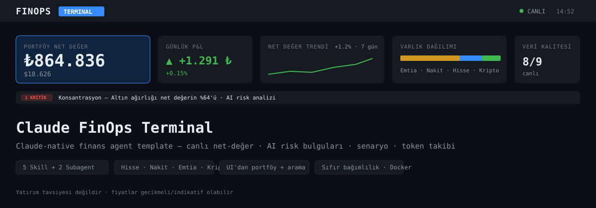
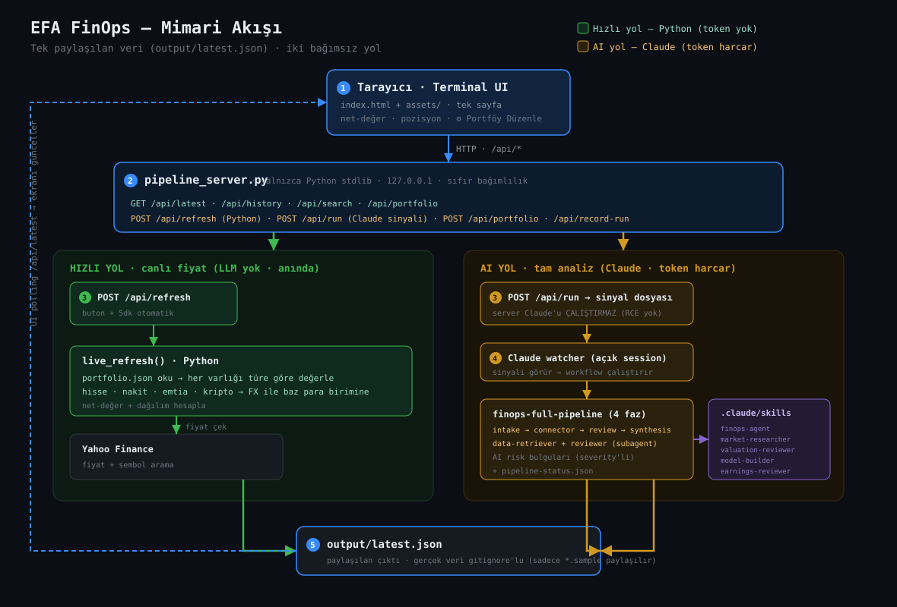

<div align="center">

# 📊 EFA FinOps Terminal

**Claude-native portfolio terminal — live net-worth, AI risk analysis, scenario & token tracking.**
**Claude-native portföy terminali — canlı net-değer, AI risk analizi, senaryo & token takibi.**

[English](#-english) · [Türkçe](#-türkçe)

    



</div>

---

## 🇬🇧 English

A single-screen, Bloomberg-style **portfolio terminal** powered by **Claude agents**. Plug in your own
holdings — stocks, cash, gold, crypto — and get a live net-worth, AI-generated risk findings,
scenario projections and a clean activity feed. **Zero runtime dependencies** (Python stdlib only).

> ⚠️ Educational sandbox — **not investment advice**. Prices may be delayed/indicative.

### ✨ Why you'll like it

- **🔌 Plug-and-play portfolio** — search by name (*"Apple"*, *"Tüpraş"*, *"Bitcoin"*), we resolve the
  Yahoo ticker for you. No need to know symbols.
- **🧠 Real AI analysis** — a `reviewer` subagent flags concentration, FX and single-asset risks with
  severity levels — not rule-based templates.
- **💹 Any asset** — equities (NASDAQ/BIST/XETRA…), cash (TRY/USD/EUR), commodities (gold/silver),
  crypto (BTC/ETH…). Everything normalized to your base currency, live.
- **📈 One screen** — net-worth + daily P&L + trend, positions, allocation, scenarios, market watch,
  AI findings, history & token usage — all in a clean terminal.
- **🪙 Token-aware** — every Claude analysis run is counted; see total tokens spent in the top bar.
- **🐳 Zero deps + Docker** — stdlib-only server, one `./start.sh` or `docker compose up`.
- **🔒 Privacy-first** — your real holdings stay local (gitignored); only `*.sample` data is shared.

### 🚀 Quick start

```bash
git clone https://github.com/efaslantas/claude-finops.git
cd claude-finops
./start.sh            # → http://localhost:8765
```

Then click **⚙ Edit Portfolio**, search your assets by name, set quantities, **Save** — prices load live.

Docker:
```bash
docker compose up --build   # → http://localhost:8765
```

### 🧩 How it works — the Claude agent composition

This is a reference implementation of Anthropic's **skill + connector + subagent** finance-agent pattern,
running natively on Claude Code:

| Concept | Here | Location |
|---|---|---|
| **Skill** (instructions + domain) | 5 Agent Skills | `.claude/skills/<name>/SKILL.md` |
| **Connector** (data access) | Claude WebFetch / Yahoo Finance | `connectors/live-quotes/` |
| **Subagent** (sub-task) | data-retriever + reviewer | `.claude/agents/<name>.md` |



**5 skills:** `finops-agent` (net-worth) · `market-researcher` · `valuation-reviewer` ·
`model-builder` · `earnings-reviewer`. Full technical breakdown → [Architecture deep-dive](#-architecture-deep-dive).

### 🖥️ The screen (F-keys)

`F5` Scenario · `F6` Allocation · `F7` Market watch · `F8` Risk findings · `F9` Reports ·
`F10` History & tokens · `F12` Mini CLI.

### 📁 Structure

```
index.html · assets/        → terminal UI (single page, no build)
pipeline_server.py          → static server + /api bridge (stdlib only)
.claude/skills · agents · workflows  → the AI agent composition
data/*.sample.json          → example portfolio (yours stays gitignored)
Dockerfile · docker-compose.yml · .github/workflows/ci.yml
```

### 🤝 Contributing

See [CONTRIBUTING.md](CONTRIBUTING.md). Rule #1: **never commit real financial data** — `.gitignore`
keeps `data/*.json` and `output/*` local; only `*.sample.json` is shared.

### 📜 License

MIT — see [LICENSE](LICENSE). **Not investment advice.** Do your own research.

---

## 🇹🇷 Türkçe

**Claude agent'larıyla** çalışan, tek ekranlık Bloomberg-tarzı bir **portföy terminali**. Kendi
varlıklarını gir — hisse, nakit, altın, kripto — anında canlı net-değer, AI risk bulguları, senaryo
projeksiyonları ve temiz bir aktivite akışı al. **Sıfır çalışma-zamanı bağımlılığı** (sadece Python stdlib).

> ⚠️ Eğitim amaçlı sandbox — **yatırım tavsiyesi değildir**. Fiyatlar gecikmeli/indikatif olabilir.

### ✨ Neden hoşuna gidecek

- **🔌 Tak çalıştır portföy** — isimle ara (*"Apple"*, *"Tüpraş"*, *"Bitcoin"*), Yahoo ticker'ını biz
  buluruz. Sembolü bilmene gerek yok.
- **🧠 Gerçek AI analizi** — `reviewer` subagent'ı konsantrasyon, FX ve tek-varlık risklerini
  önem seviyesiyle (KRİTİK/ÖNEMLİ/ÖNERİ) işaretler — kural-tabanlı şablon değil.
- **💹 Her varlık türü** — hisse (NASDAQ/BIST/XETRA…), nakit (TRY/USD/EUR), emtia (altın/gümüş),
  kripto (BTC/ETH…). Hepsi baz para birimine canlı çevrilir.
- **📈 Tek ekran** — net-değer + günlük P&L + trend, pozisyonlar, dağılım, senaryolar, piyasa takibi,
  AI bulguları, geçmiş & token kullanımı — hepsi temiz bir terminalde.
- **🪙 Token farkında** — her Claude analiz çalıştırması sayılır; harcanan toplam token üst barda görünür.
- **🐳 Sıfır bağımlılık + Docker** — stdlib-only sunucu, tek `./start.sh` ya da `docker compose up`.
- **🔒 Gizlilik önce** — gerçek varlıkların lokal kalır (gitignore'lu); sadece `*.sample` veri paylaşılır.

### 🚀 Hızlı başlangıç

```bash
git clone https://github.com/efaslantas/claude-finops.git
cd claude-finops
./start.sh            # → http://localhost:8765
```

Sonra **⚙ Portföy Düzenle**'ye tıkla, varlıklarını isimle ara, miktar gir, **Kaydet** — fiyatlar canlı yüklenir.

Docker:
```bash
docker compose up --build   # → http://localhost:8765
```

### 🧩 Nasıl çalışır — Claude agent kompozisyonu

Anthropic'in **skill + connector + subagent** finans-agent kalıbının Claude Code üzerinde native
referans uygulamasıdır:

| Kavram | Buradaki | Konum |
|---|---|---|
| **Skill** (talimat + domain) | 5 Agent Skill | `.claude/skills/<ad>/SKILL.md` |
| **Connector** (veri erişimi) | Claude WebFetch / Yahoo Finance | `connectors/live-quotes/` |
| **Subagent** (alt görev) | data-retriever + reviewer | `.claude/agents/<ad>.md` |


**5 skill:** `finops-agent` (net-değer) · `market-researcher` · `valuation-reviewer` ·
`model-builder` · `earnings-reviewer`. Tam teknik döküm → [Architecture deep-dive](#-architecture-deep-dive).

### 🖥️ Ekran (F-tuşları)

`F5` Senaryo · `F6` Dağılım · `F7` Piyasa takibi · `F8` Risk bulguları · `F9` Raporlar ·
`F10` Geçmiş & token · `F12` Mini CLI.

### 🤝 Katkı

[CONTRIBUTING.md](CONTRIBUTING.md)'ye bak. Kural #1: **gerçek finansal veriyi asla commit etme** —
`.gitignore` `data/*.json` ve `output/*`'ı lokal tutar; sadece `*.sample.json` paylaşılır.

### 📜 Lisans

MIT — [LICENSE](LICENSE). **Yatırım tavsiyesi değildir.** Kendi araştırmanı yap.

---

## 🖼️ Screens

Each section is one F-key away on a single page. *(Banner/diagrams above are SVG; drop real captures into
`docs/` as `screen-<name>.png` and link them here.)*

| Key | Panel | What it shows |
|---|---|---|
| — | **Hero band** | Net-worth · daily P&L · trend sparkline · allocation bar · data quality · token badge |
| — | **Risk ribbon** | Top critical AI finding (click → F8) |
| — | **Positions** | Every holding: qty · live price · value · weight · class (dynamic, any portfolio) |
| `F5` | **Scenario** | Bear / base / bull derived from live prices + portfolio impact |
| `F6` | **Allocation** | Asset-class % + currency exposure + FX sensitivity table |
| `F7` | **Market watch** | Your holdings (★) + watchlist, live |
| `F8` | **Risk findings** | `reviewer` subagent output, severity-sorted |
| `F9` | **Reports** | `output/*.md` skill outputs, markdown-rendered |
| `F10` | **History** | Daily net-worth trend + AI token usage |
| `F12` | **Mini CLI** | `help`, `portfolio`, `skills`, … |
| modal | **⚙ Edit Portfolio** | Search assets by name → ticker auto-filled → save → live-valued |

---

## 🔬 Architecture deep-dive

The system has **two independent data paths** sharing one `output/latest.json`. This separation is
deliberate — it keeps the always-on server safe while still allowing full AI analysis.

```
                       ┌─ POST /api/refresh ─→ live_refresh()  [Python, no LLM]  ─┐
   Terminal UI ────────┤                                                          ├─→ output/latest.json ─→ UI
                       └─ POST /api/run ─→ signal file ─→ Claude watcher ─→ workflow ┘  [Claude AI]
```

<details>
<summary><b>1 · Two data paths & the RCE-safe signal model</b></summary>

- **Path A — `live_refresh()` (Python, no LLM, instant):** reads `data/portfolio.json`, fetches quotes
  from Yahoo, values every holding into the base currency, writes `output/latest.json`. Powers the
  **🔄 price refresh** button and the 5-min auto-tick. **Costs zero tokens.**
- **Path B — Claude pipeline (full AI):** the **▶ button** does *not* let the server execute Claude
  (that would be a network-reachable RCE). Instead `POST /api/run` writes a **signal file**
  (`output/pipeline-trigger.json` + sets `pipeline-status.json` to `running`). A **trusted, already-open
  Claude session** (a watcher cron) sees the signal and runs the `finops-full-pipeline` workflow, which
  writes `latest.json` + AI `reviewer_findings`. The server **never spawns Claude.** Bind defaults to
  `127.0.0.1`.

</details>

<details>
<summary><b>2 · Skill anatomy</b></summary>

Each skill is a markdown file with YAML frontmatter (`name`, `description`) + instructions. Claude Code
auto-loads it; `/skill-name` or a natural trigger invokes it. The five skills share two subagents.

```
.claude/skills/finops-agent/SKILL.md        # orchestrator: intake → connector → review → synthesis
.claude/skills/market-researcher/SKILL.md    # live stock/sector research (news + catalysts + risks)
.claude/skills/valuation-reviewer/SKILL.md   # P/E · EV/EBITDA · peer comparison
.claude/skills/model-builder/SKILL.md        # FX / bear-base-bull / accumulation projections
.claude/skills/earnings-reviewer/SKILL.md    # earnings vs consensus
```
</details>

<details>
<summary><b>3 · Subagent contracts</b></summary>

- **`data-retriever`** — given holdings, fetches live quotes (Yahoo v8 `chart` API), normalizes to the
  base currency, returns a structured `holdings_with_prices[]` + a `quality_report`. No fabrication: a
  missing quote is reported as missing.
- **`reviewer`** — given the valued portfolio, performs methodology checks **and** a genuine AI risk
  read (concentration, FX exposure, single-asset dominance, sector clustering). Output is a
  `findings[]` array, each `{severity, issue}` where severity ∈ `KRİTİK / ÖNEMLİ / ÖNERİ / BİLGİ`.

</details>

<details>
<summary><b>4 · Workflow orchestration (<code>finops-full-pipeline.js</code>)</b></summary>

A deterministic 4-phase pipeline that fans subagents out and synthesizes:

```
intake     → validate data/portfolio.json
connector  → data-retriever: live quotes (reads tickers from portfolio.json)
review     → reviewer: AI findings + approval
synthesis  → compute breakdown, carry prev net-worth, write latest.json + pipeline-status.json
```
Quantities are read from `portfolio.json` (never hardcoded), so any portfolio works.
</details>

<details>
<summary><b>5 · Generic valuation model</b></summary>

Every holding declares `type`, `ticker`, `ccy`. Value (in base currency) by type:

| type | formula |
|---|---|
| `cash` | `amount × fx(ccy → base)` |
| `equity` / `crypto` | `quantity × price(ticker) × fx(ccy → base)` |
| `commodity` | `quantity × price/unitDiv × fx(ccy → base)` — `unitDiv = 31.1035` for gram-of-troy-oz |

`fx(ccy)` fetches `{ccy}{base}=X` once and caches. Asset-class breakdown is computed dynamically from
the set of types present (Emtia / Nakit / Hisse / Kripto / …).
</details>

<details>
<summary><b>6 · API reference</b></summary>

| Method · Path | LLM? | Does |
|---|---|---|
| `GET /api/latest` | — | current `latest.json` |
| `GET /api/history` | — | daily net-worth + token totals |
| `GET /api/search?q=` | — | Yahoo symbol search (name → ticker) |
| `GET /api/portfolio` | — | load holdings (for the edit form) |
| `POST /api/portfolio` | — | save holdings → `live_refresh()` |
| `POST /api/refresh` | — | live prices → recompute net-worth |
| `POST /api/run` | — | write AI-analysis **signal** (watcher executes) |
| `POST /api/record-run?tokens=N` | — | log a pipeline run + tokens |
</details>

<details>
<summary><b>7 · <code>portfolio.json</code> schema</b></summary>

```json
{
  "base_currency": "TRY",
  "holdings": [
    { "id": "NVDA", "name": "NVIDIA", "type": "equity", "ticker": "NVDA", "ccy": "USD", "quantity": 4 },
    { "id": "TRY_CASH", "name": "TL Nakit", "type": "cash", "ccy": "TRY", "amount": 100000 },
    { "id": "GOLD", "name": "Gram Altın", "type": "commodity", "ticker": "GC=F", "ccy": "USD", "unit": "gram", "quantity": 50 },
    { "id": "BTC", "name": "Bitcoin", "type": "crypto", "ticker": "BTC-USD", "ccy": "USD", "quantity": 0.05 }
  ]
}
```
</details>

---

<div align="center"><sub>Built with <a href="https://claude.com/claude-code">Claude Code</a> · Banner & diagrams are SVG — drop real screenshots into <code>docs/</code> to showcase the live UI.</sub></div>
